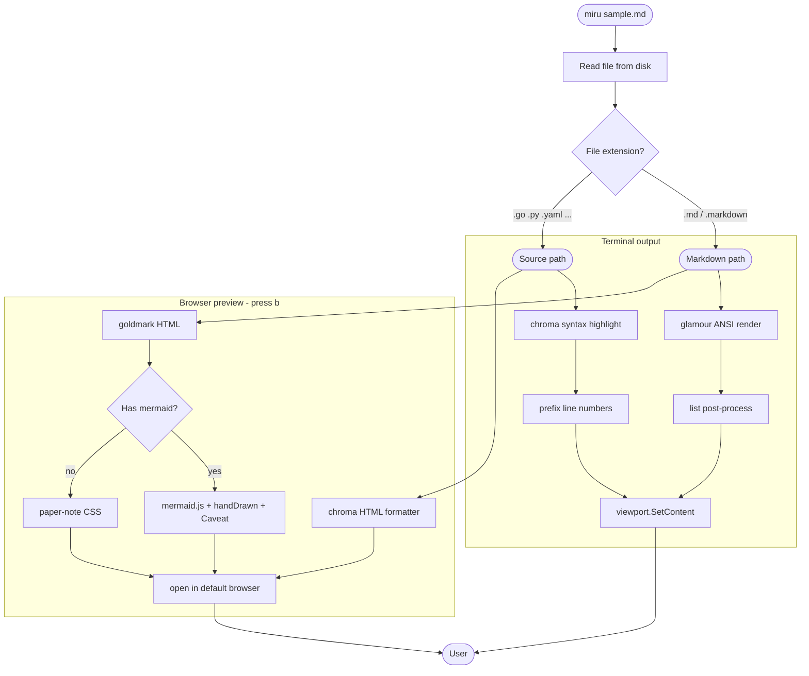

# miru sample

This is a markdown file for trying out **miru**. It covers the basic syntax.

## Headings

### h3 heading

#### h4 heading

##### h5 heading

###### h6 heading

## Text styling

Regular text. **Bold** and *italic* and ***bold italic*** and ~~strikethrough~~ all mix together.
Inline code is wrapped in backticks like `const x = 42`.

Short commands such as `miru sample.md` and paths like `internal/render/glamour.go` can also be written in `code` style.

## Unordered list (`-` / `*`)

- Item 1
- Item 2
  - Nested 2-1
  - Nested 2-2
    - Deep nested 2-2-1
    - Deep nested 2-2-2
  - Nested 2-3
- Item 3

* Asterisk style
* Asterisk 2
  * Nested
  * Nested

## Ordered list

1. First
2. Second
   1. Nested 2-1
   2. Nested 2-2
      1. Deep nested
      2. Deep nested
3. Third

## Mixed nesting

1. Parent (ordered)
   - Child (unordered)
   - Child
     1. Grandchild (ordered)
     2. Grandchild
   - Child
2. Parent
   - Child
3. Parent

## Task list

- [x] Design
- [x] Phase 1 implementation
- [ ] Phase 2 implementation
- [ ] Release script

## Blockquote

> A single-line quote.

> A quote that spans
> multiple lines.
> Beauty comes first.
>
> Paragraphs can be split too.

> Quote with
>> nested quote
>>> and even deeper

## Code blocks

Go:

```go
package main

import (
    "fmt"
    "os"
)

func main() {
    if len(os.Args) < 2 {
        fmt.Fprintln(os.Stderr, "usage: miru <file>")
        os.Exit(2)
    }
    fmt.Printf("hello, %s\n", os.Args[1])
}
```

TypeScript:

```ts
type User = { id: string; name: string };

async function fetchUser(id: string): Promise<User> {
  const res = await fetch(`/users/${id}`);
  if (!res.ok) throw new Error("not found");
  return res.json();
}
```

Bash:

```sh
#!/bin/bash
set -euo pipefail
for f in *.md; do
  miru "$f"
done
```

## Mermaid diagrams (browser only)

In the terminal, mermaid blocks render as plain code. Press `b` to open in the browser, where the diagram is drawn by mermaid.js.



## Table

| Feature | Status | Notes |
|---|:---:|---:|
| TUI | done | Bubble Tea v2 |
| Browser view | done | goldmark + GitHub CSS |
| Search | todo | Phase 2 |
| TOC | todo | Phase 2 |

Alignment hints (`:---` left, `:---:` center, `---:` right) work too.

## Links and images

[Charm](https://charm.sh) / [goldmark](https://github.com/yuin/goldmark) / autolink <https://example.com>

Reference-style link: [Charm][charm]

[charm]: https://charm.sh "Charm.sh"

Image (rendered as text in the TUI):


## Horizontal rule

---

A horizontal rule above and below this line.

## Definition list

Markdown
: A lightweight markup language

Glamour
: A markdown renderer for terminals

## Escaping

`\*` escapes the asterisk, producing a literal \* character.

## Long paragraph (wrapping check)

Lorem ipsum dolor sit amet, consectetur adipiscing elit. Sed do eiusmod tempor incididunt ut labore et dolore magna aliqua. Ut enim ad minim veniam, quis nostrud exercitation ullamco laboris nisi ut aliquip ex ea commodo consequat. Duis aute irure dolor in reprehenderit in voluptate velit esse cillum dolore eu fugiat nulla pariatur. Excepteur sint occaecat cupidatat non proident, sunt in culpa qui officia deserunt mollit anim id est laborum.
